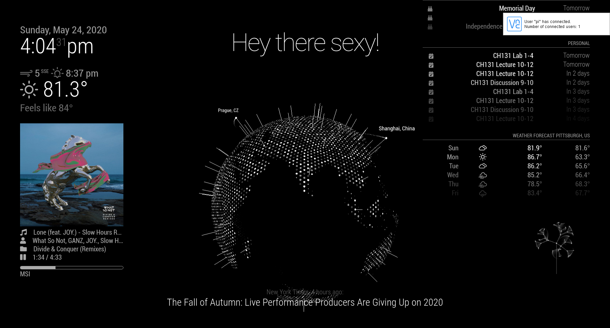

# rpi-mirror
Magic Mirror 2 implementation of APIs/live widgets such as local weather, newsfeed, calendar, OpenGL rotating globe with mapped N/W/S/E coordinates, a live Spotify song "playing" view, & a short video display (gifs or such images), in my case, with Darwin's "Tree of Life"

Default app view scaffolding can be cloned by --> git clone https://github.com/MichMich/MagicMirror

